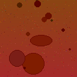

+++
date = '2025-01-01T21:03:29-05:00'
draft = false
title = 'Skinning a turn-based game with gen AI'
+++

We are currently developing a turn based strategy [game](https://martians-nine.vercel.app) with Michal Srb. Let me explain you the rules first. I fed the following prompt to ChatGPT o1:

---
>Let me explain you the rules first:
>
>The game is a turn-based strategy where two players play against each other. Each player tries to connect energy resources (green circles with R) to habitats (circles labeled with P) using pipes (the thick lines).
>
>Each habitat has a certain population (the number that appears after P). The goal of the game is to get a total population of 30 before your oponent and not run out of energy. 
>
>You can do it as follows: each player starts with 10 energy. In every turn, you can either build two pipes (each cost 1 energy) or transform a pipe into a habitat (for 5 energy). You cannot branch pipes, but you can build in all four directions around a habitat. 
>
>Each habitat starts with 2 population and has at most 10 inhabitants. It produces 3 energy in every round, but every inhabitant also consumes 1 energy. Every three rounds, the population of a habitat increases by one, unless it is at maximum capacity. 
>
>You can use pipes to connect Resources. Each resource adds 2 energy per round. 
>
>Lastly, the game happens on a 15 x 15 board that "wraps around". So you can build pipes from right edge to the left edge and from the bottom edge to the top edge. Pipes cannot cross. 
>
>Can you rewrite the above  so that the rules are easy to understand and I can check that you understood? 
---

Here's the concise answer. Not bad! 

># Game Rules: Turn-Based Strategy
> ## 1. Overview
> 
> - **Players:** There are two players.
> - **Board Size:** 15 × 15 grid that “wraps around.”
>   - You can connect the right edge to the left edge, and the top edge to the bottom edge.
> 
> ---
> 
> ## 2. Objective
> 
> - **Win Condition:** Be the first to reach a combined population of **30** across your habitats.
> - **Energy Management:** Avoid running out of energy (your energy must stay ≥ 0).
> 
> ---
> 
> ## 3. Energy and Habitats
> 
> - **Starting Energy:** Each player begins with **10** energy.
> - **Habitats (P):**
>   - Start with **2** inhabitants each.
>   - Maximum population is **10**.
>   - Produce **3** energy per round.
>   - Each inhabitant consumes **1** energy per round.
>   - **Population Growth:** Every 3 rounds, each habitat’s population increases by **1**, unless the habitat is already at its max (10).
> 
> ---
> 
> ## 4. Resources (R)
> 
> - **Resources (R):**  
>   - Each resource connected to a habitat via a chain of pipes adds **+2** energy per round.
>   - A connection is considered valid if there is a continuous path of pipes from the resource to the habitat.
> 
> ---
> 
> ## 5. Building and Actions
> 
> - **Pipes:**
>   - Used to connect resources (R) to habitats (P).
>   - **Pipes cannot cross** one another.
>   - **No Branching:** You cannot branch a pipe from the middle of another pipe.
>   - **Where to Build Pipes:** Besides building directly from a habitat, you can **only** extend new pipes from the **current pipe ends** (the open endpoints, not from the middle).
>   - You can build in the four cardinal directions (up, down, left, right).
> 
> - **Turns:** On your turn, you must choose **one** of the following:
>   1. **Build two pipes** (cost = 1 energy each).  
>   2. **Transform one pipe into a new habitat** (cost = 5 energy).
> 
> ---
> 
> ## 6. Energy Flow
> 
> 1. **Energy Production (Per Round):**
>    - Sum of:
>      - 3 energy per habitat
>      - 2 energy per connected resource
> 2. **Energy Consumption (Per Round):**
>    - 1 energy for each inhabitant in your habitats.
> 3. **Net Energy:**
>    - If your net energy ever drops below 0, you cannot maintain your structures or take that action.
> 
> ---
> 
> ## 7. Victory
> 
> - **Population Goal:** Reach a total of **30** inhabitants (across all your habitats) before your opponent.
> - **Energy Stability:** Ensure you have enough energy each round to sustain your habitats and build or upgrade as needed.
> 
> ---

Feeding rules of the game to ChatGPT o1 came up in a discussion with Tom Krcha and he ran the first couple of experiments with similarly good results.

### Many ways to skin the game
Now that the model has some rules context about the basic game concepts, let's see how lucky we get with skinning. This is what the game looks like at the moment:


 Here's my first prompt: 

>
>Great! Here is a snapshot of the current game interface. Could you add textures to it? 
>
>I would like the environment to look like a deserted planet, perhaps Mars in the distant future, inhabited by the first few humans. 

ChatGPT gave me a guideline on how to design the tileset, but did not give me any graphics first. It then helped me to generate a project structure to display the tiles correctly. But then came a shocker, it output a PNG in Base64 encoding as a desert tile!

```
data:image/png;base64,
iVBORw0KGgoAAAANSUhEUgAAAEAAAABACAQAAAAAYLlVAAABJUlEQVR4nO3WAQEDURDE0dE
2bdPO0p6E8YIsZLLGmyKRgWFExFiBnTw//9+H8Es0y7+VKeiDpG4HtMd0WaPK0Jp9RaPG70
fAWNcxRFC/DBF+DEUBZHBGCmlsUP9Nj1+Db8uO9kjnlwjaN71KITphkD1PTV5M0bSdQvNt
k4VQp5nBCXFreIHIgIQ/v8i0NPeKugANrfSgD2FlF/89NVEWIsYPefrEybtS9gND3/Q8V
0ItyhtZFebcR3DP5Bw09XScW5BZaZwAAAABJRU5ErkJggg==
```

What a marvelous idea. Unfortunately, this does not seem to be valid (if you somehow manage to decode this, let me know). I tried for some time, but ultimately failed. Also, what a way to potentially get some malware into your laptop! On the next attempt, ChatGPT got frustrated and it spit out a Python script to generate a texture.

```
import base64
import io
from PIL import Image

def create_mars_gradient_png():
    """Create a 32×32 vertical gradient resembling a Mars-like palette."""
    width, height = 32, 32

    # Starting color (top):  #8B4513 -> (139, 69, 19)
    # Ending color (bottom): #A52A2A -> (165, 42, 42)
    start_r, start_g, start_b = (139, 69, 19)
    end_r, end_g, end_b = (165, 42, 42)

    img = Image.new("RGB", (width, height))

    for y in range(height):
        # Interpolate each channel based on y
        ratio = y / (height - 1)  # from 0.0 (top) to 1.0 (bottom)
        r = int(start_r + (end_r - start_r) * ratio)
        g = int(start_g + (end_g - start_g) * ratio)
        b = int(start_b + (end_b - start_b) * ratio)

        # Fill row y with the interpolated color
        for x in range(width):
            img.putpixel((x, y), (r, g, b))

    return img

def encode_image_to_base64(img):
    """Encode a PIL Image to a Base64 string (PNG format)."""
    buffer = io.BytesIO()
    img.save(buffer, format="PNG")
    encoded_bytes = base64.b64encode(buffer.getvalue())
    return encoded_bytes.decode("utf-8")

if __name__ == "__main__":
    # Create the Mars-like gradient image
    mars_img = create_mars_gradient_png()

    # Encode it in Base64
    mars_base64 = encode_image_to_base64(mars_img)

    # Print out the result
    # (Feel free to remove the 'data:image/png;base64,' prefix if you only want raw Base64)
    print("data:image/png;base64," + mars_base64)
```

Here's the masterpiece: 
So why not try to generate the whole set of tiles, this time in 128x128? 

This was the answer: 

,

Kind of boring. Can you add some debris, rocks and craters to add variety? This gave me the following image generator: 

,, , 

Not entirely useful, but there seems to be some potential. So let's force it to use Perlin noise? 

,, , 

Add "shader" behavior, so that the splats blend in better with the background? That did not work well at all: 

,

Oh well. I almost gave up at this point, until Tom sent me this: 


So there is some way clearly! 

## Round 2
After all that we've been through, now that the model has a lot of   context it needs, let me just ask... 
> Can you generate an image asset for the habitat? 


Not bad at all after. What about a list of sprites: 


That's probably it, the middle four look almost immediately useful! Perhaps except for some issues with transparency that I need to take care of. Tom also recommended generative models that use [controlnet](https://github.com/lllyasviel/ControlNet), which I am excited to understand and perhaps blog about later.

Thanks to Tom Krcha for hints and Michal Srb for the joint work on this!

