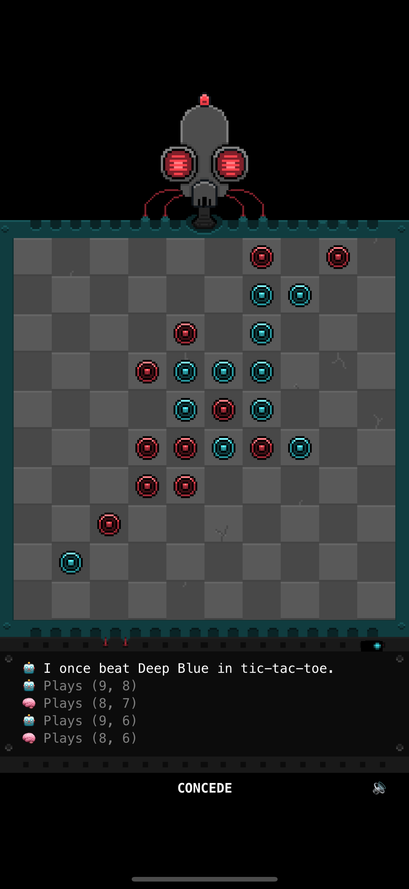
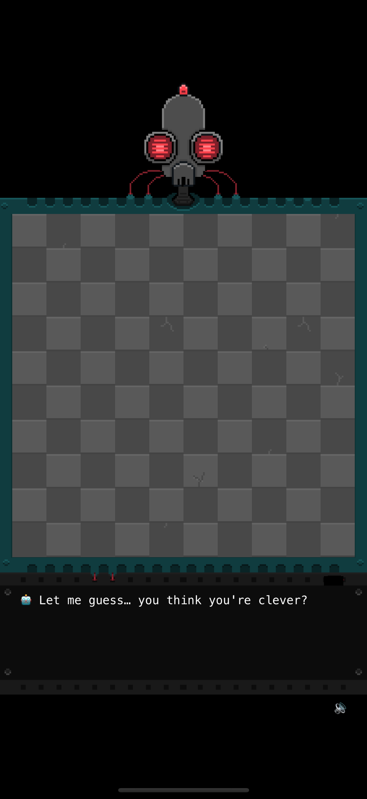

+++
date = '2025-07-02T22:41:07-04:00'
title = 'Releasing Piskvor Prime: A Five-in-a-Row Game with Personality'
description = "How I tried to give a classic board game some personality"
tags = ["gamedev", "AI", "minimax", "indie", "gomoku", "ai", "pixel art", "spritekit", "ios"]
+++

Piskvor Prime is an iOS game I developed last month and succesfuly launched on appstore. [TestFlight](https://testflight.apple.com/join/cAJGxJBv) it or support me by [buying it here](https://apps.apple.com/us/app/piskvor-prime/id6746420976). 

## The Beginning: Just an AI Engine

Piskvor Prime started as a hobby project — a simple AI engine for five-in-a-row (also known as Piskvorky in Czech). I was experimenting with heuristic-based move selection in minimax and had no intention of turning it into a game but once the AI started playing decent moves, I decided it would be a pity to shelve it.  

## Piskvorky with Attitude

Most puzzle games are quiet, but I wanted mine to talk back.

So I gave the AI a voice. Not just any voice — one that taunts you when you make a mistake, gloats when it wins, and occasionally glitches out mid-thought. Over time, I prompted an LLM to wite hundreds of reactive phrases, ranging from sarcastic remarks to cryptic comments hinting at a deeper backstory. I used iOS audio sync engine to give Piskvor a voice. iOS does not have any robotic voices, but IN-EN accent suits him quite well. 

## Art Style, Aesthetic and Lore

I went for a clean pixel art aesthetic that wouldn’t get in the way of gameplay. The board is minimalistic, but the UI has subtle animations, glitch effects, and a terminal-like interface. As you play more games, Piskvor Prime begins revealing snippets of lore — corrupted logs, developer notes, and strange inscriptions on a mechanical door. The deeper you go, the more questions arise. Why is it obessed with shrimp? What happened to the original dev team?

## Building the Game

I built Piskvor Prime using **Swift** and **SpriteKit**, with all game logic written from scratch. The AI uses a minimax variant with top-k move pruning, and the whole project was developed solo in my free time. It was surprisingly difficult to get the AI right and it is by no means perfect, but I think that it is just about the right difficulty for it to not be boring. 

Key systems:

* **AI Engine** with taunting & evaluation heuristics
* **Dynamic log system** that displays taunts, messages, and lore
* **Procedural inscription system** for the mysterious door
* **Speech synthesis** for an optional robotic voice

## Challenges

The AI runs on a separate thread and the early version of the game had a subtle racing condition, a bug I found hard to reproduce. That is hopefully gone in version 1.1. Balancing the AI so it felt fun but not unbeatable took a lot of iteration. TestFlight helped me catch edge cases and polish the UI - thanks to all the testers! 

## Launch & What’s Next

Piskvor Prime is now live on the App Store. I’m proud of how it turned out — not just a puzzle game, but a small narrative experience and people seem to be having fun. The game is by no means perfect and you can give me some feedback on [TestFlight](https://testflight.apple.com/join/cAJGxJBv). If you like the game, you can also support me by buying it [here](https://apps.apple.com/us/app/piskvor-prime/id6746420976). 

I hope that it will make you laugh!

---

*Built by a solo developer who did not want to shelve another project.*

